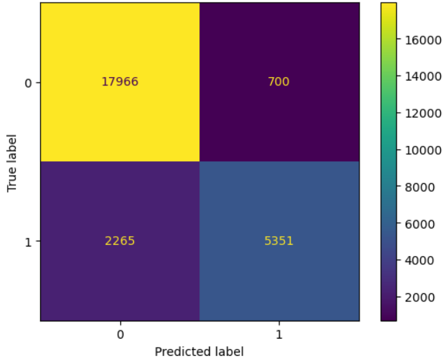
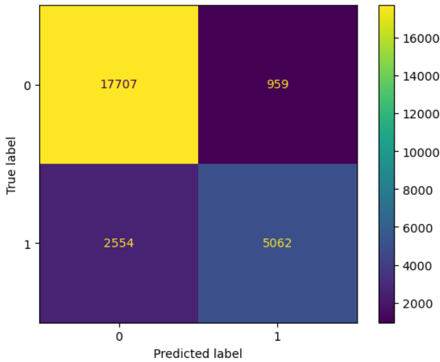

# Transporter Protein Identification Model in paper [put paper name]

This repository contains the embeddings and evaluation data using our model to predict if a protein sequence is that of a transporter protein or not.

The exact way our model and dataset was collected can we found here: [link to paper].

## About the datatset

The dataset folder that contains both the testing and training data used is found here [link ORCID id]. Should be placed in the root directory as /dataset/. The datasets named final_testing.csv final_training.csv are contained here.

## Examples 

Two examples showing how to predict based on sequence are given the examples/ folder.

## Summary of results 

We using our model, BLAST and <a href="https://github.com/ying-jc/DeepTP">DeepTP</a>, we obtained the following metrics on the test dataset for predicting whether a protein is a transporter or not. 

||Our Model| Blast|DeepTP |
|---|---|---|---|
| Accuracy | 0.8871851457271136  | 0.8663343733353626|0.8110226475805453|
| Precision | 0.8843166418773757| 0.8407241322039528|0.4581889407864999|
| recall | 0.7025997899159664   | 0.6646533613445378|0.7553402881271734|
| F1 | 0.7830540718519061       |0.7423920217056537|0.5703835693519647|

The details are described below. 

## Evaluation on our test dataset 

We obtained the following results using our model on our test dataset.
|||
|---|---|
| Accuracy | 0.8871851457271136  |
| Precision | 0.8843166418773757|    
| recall | 0.7025997899159664   |
| F1 | 0.7830540718519061       |

Confusion matrix 

### Code 
Model_evaluation.ipynb evaluates our model on our test dataset using our model.

The dataset folder for testing is found here [link ORCID id]. Should be placed in the root directory as /dataset/. The final_testing.csv data is used in this code.

## Comparison to BLAST 

Using our training data to create a database for BLAST, we obtained the following results using BLAST on our test dataset.

|||
|---|---|
| Accuracy | 0.8663343733353626  |
| Precision | 0.8407241322039528|    
| recall | 0.6646533613445378   |
| F1 | 0.7423920217056537       |

Confusion matrix 

### Code 

We use our training data, also in the dataset folder, to create a database of transporters. We then used BLAST to compare test sequences to those in our created BLAST database.

We use the the code using the code in BLAST_benchmarking/

We first run 1-create_database.ipynb, then 2-run_blast.py, then 3-results.ipynb to view the results.

## Comparison to <a href="https://github.com/ying-jc/DeepTP">DeepTP</a> 

Using another trained deep learning model linked above, we obtained the following results on our test dataset.

|||
|---|---|
| Accuracy | 0.8110226475805453  |
| Precision | 0.4581889407864999|    
| recall | 0.7553402881271734   |
| F1 | 0.5703835693519647       |

Confusion matrix: 

### Code 
We use our training data, also in the dataset folder, to compared to another transporter prediction model based on deep learning.

We use the the code using the code in BLAST_benchmarking/

One simply needs to run the code in run_DeepTP.ipynb.

The dataset folder for testing is found here [link ORCID id]. Should be placed in the root directory as /dataset/. The final_testing.csv data is used in this code.

